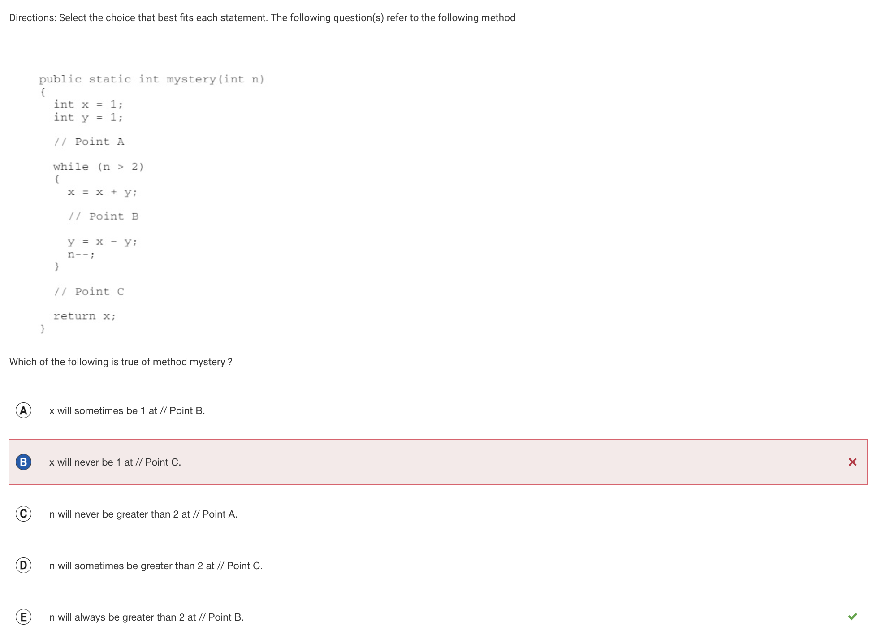
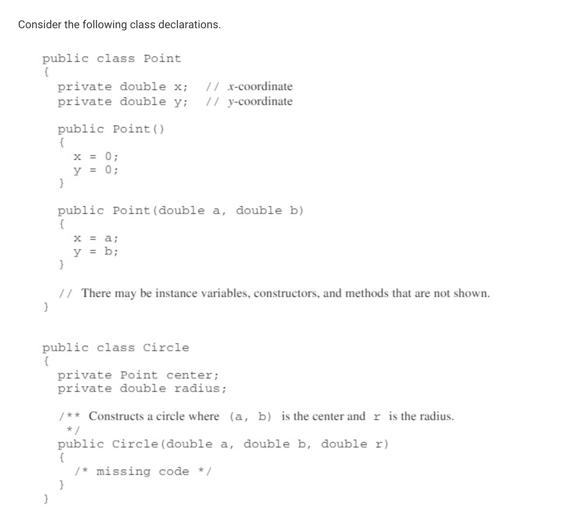
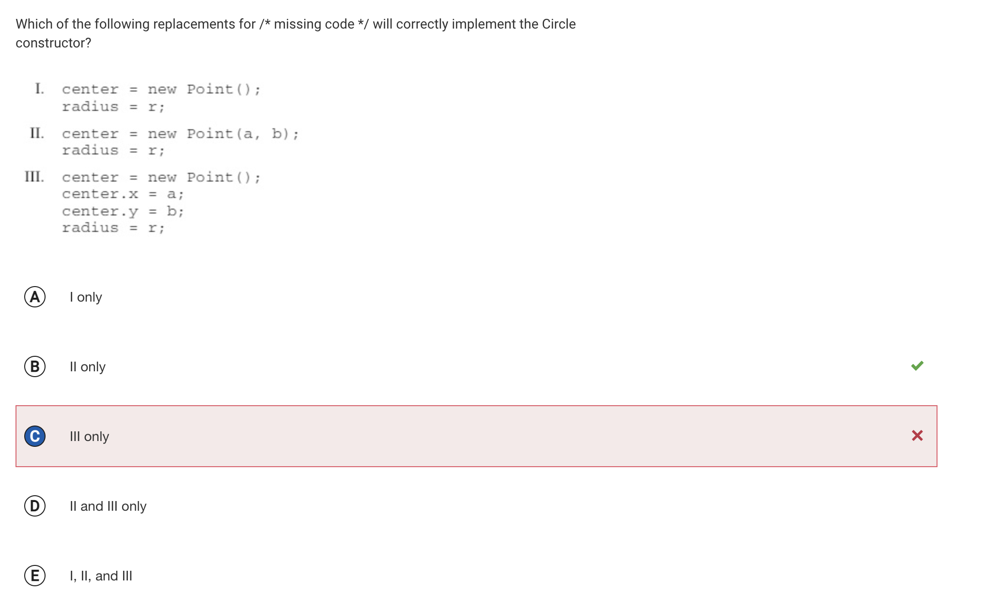
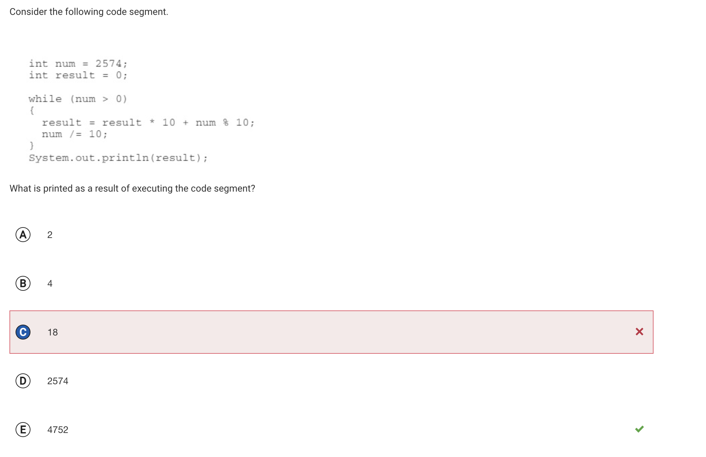
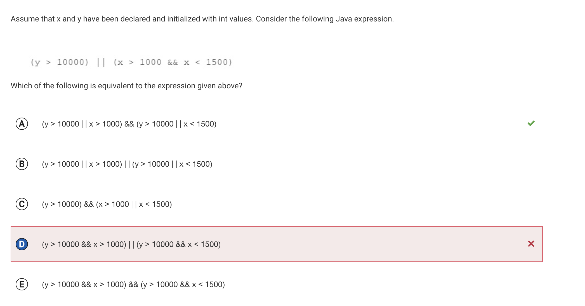
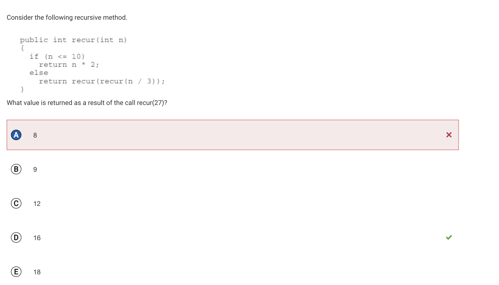
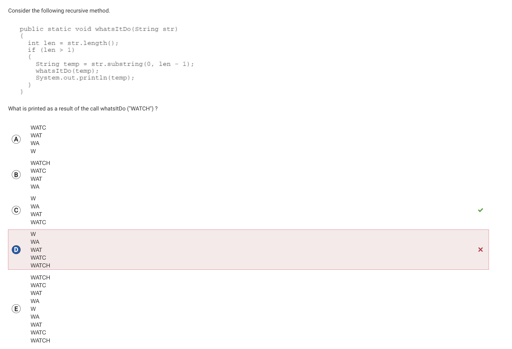

# The AP Collegeboard Test

For our final for APCSA trimester one, we had to take a test on college board on crucial concepts in Java.
I got 33/40, which still gets me 100% in the class, but these are the corrections for the 7 questions I missed.

## Question 22

I got this question wrong because I thought that you had to specify a method would be overriden when creating a 
new function in the child class with the same method signature as a function in the parent class. However, this
was wrong. That's why D is wrong.

My other mistake was that I didn't realize that, since books only takes in a list of the object Book, using a 
child class AudioBook to create an object in the list is valid, but it'll only be considered as a Book and will 
be unable to access methods unique to its child class. That's why the correct answer is B, because books[0] can't 
access methods that are in the child class.

## Question 28

I'm not exactly sure why I got this wrong, but I think it's because I thought the loop would always run, therefore x would 
never be equal 1 after the loop, which is false, because n can be given a value less than 2. That's why B is wrong.

E is right because the conditions for the loop to run necessitates that n is greater than 2, therefore it'll always be greater 
than 2 inside the loop.

## Question 34

I don't know why I got this question wrong. I realized that I wouldn't work because it never sets the center point and III 
wouldn't work because the Circle class can't access private attributes, but I still chose the wrong answer. I think I just
misclicked.

## Question 35

I got this question wrong because I forgot to consider result * 10 in the reassignment of result. I thought that the program 
simply summed up the digits in the number, which is why I chose 18. But result * 10 actually means that the digits in the 
number are being switched around, which is why 4752 is the right answer.

## Question 38

I got this question wrong because I forgot to consider that y being greater than 10000 is not necessary for the expression 
to evaluate to be true. My response does evaluate to true if y > 10000, but I forgot that the other conditions of x < 1500 
and x > 1000 can also be true to make the expression evaluate to be true.

Option A does consider both of these options, which is why it's the correct answer.

## Question 39

This question was really hard for me. The double recursion made things super confusing for me, until I realized that the loop 
of recursion would continue until n was less than or equal to 10. I thought that the answer must be less than 10, which is why 
I chose 8, but I forgot to realize it would multiple it by 2 one last time before returning n, which is why 16 is actually the 
right answer. 

## Question 40

I didn't realize that the program would print temp instead of the original string, which is why I thought it would still print 
"WATCH" at the end and not just "WATC". That's why Option C is the right answer and not Option D.